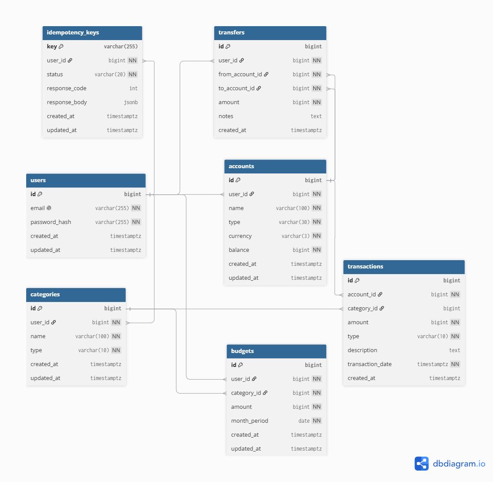

# Personal Finance & Ledger API

[](https://github.com/Verrellaksono/personal-finance-api/actions/workflows/ci.yml)
[](https://golang.org)
[](https://www.postgresql.org)
[](https://www.docker.com)
[](./docs/openapi.yml)

## Bahasa Indonesia

### Ringkasan Proyek

**Personal Finance & Ledger API** adalah layanan backend finansial bertingkat produksi (_production-grade_) yang dibangun menggunakan **Go (Golang)** dan **PostgreSQL**. Backend ini dirancang dengan menerapkan prinsip **Clean Architecture**, kepatuhan **ACID** yang ketat, penguncian tingkat baris (_row-level locking_), pencegahan _deadlock_ deterministik, mekanisme transaksi _idempotent_, serta pengujian otomatis (_CI/CD_).

Sistem ini mendukung pencatatan transaksi keuangan, pengelolaan akun multi-saldo, transfer antar rekening yang aman dari _race condition_, pengawasan anggaran (_budgeting_), dan analitik laporan keuangan bulanan.

---

### Fitur Utama & Keunggulan Teknikal

- **Autentikasi & Otorisasi Aman (JWT):** Autentikasi berbasis JWT dengan _custom context middleware_ Go dan enkripsi password `bcrypt`. Dilengkapi proteksi IDOR (_Insecure Direct Object Reference_) untuk memastikan isolasi data pengguna.
- **Mutasi Buku Besar ACID & Lock Ordering:** Transaksi database atomic (`*sql.Tx`) menggunakan `SELECT ... FOR UPDATE` untuk mencegah _race condition_ dan _double-spending_. Menggunakan algoritma pengurutan kunci deterministik (`firstID < secondID`) saat transfer untuk mencegah _deadlock/circular wait_.
- **Engine Idempotensi Transaksi (`X-Idempotency-Key`):** Mencegah transaksi ganda akibat _network retry_ atau penekanan tombol berulang pada endpoint transfer via status atomik (`PENDING` $\rightarrow$ `COMPLETED`/`FAILED`) dan _caching response payload_.
- **Clean Architecture & Interface-Driven Design:** Pemisahan layer yang jelas (_Transport/Handler_ $\rightarrow$ _Business Logic/Service_ $\rightarrow$ _Persistence/Repository_). Mengikuti idiomatic Go (_"Accept interfaces, return structs"_), mempermudah _unit testing_ tanpa dependensi database eksternal.
- **Manajemen Anggaran & Laporan Analitik:** Penetapan budget per kategori, pelacakan persentase realisasi pengeluaran, dan analitik ringkasan bulanan (pemasukan, pengeluaran, saldo bersih).
- **Containerization Multi-Stage & CI/CD Pipeline:** Docker image minimalis berbasis Alpine Linux (~15MB), orkestrasi `docker-compose.yml`, dan pengujian otomatis via **GitHub Actions** (`go test -race ./...`).

---

### Arsitektur Sistem

```text
HTTP Client (cURL / Postman / Frontend)
           │
           ▼
┌─────────────────────────────────────────┐
│           HTTP Transport Layer          │
│  - Standard Library `net/http` & Router │
│  - JWT Auth Middleware (Context-bound)  │
│  - JSON Decoding & HTTP Status Mapping  │
└──────────────────┬──────────────────────┘
                   │
                   ▼ (Invokes Consumer Contract)
┌─────────────────────────────────────────┐
│             Service Layer               │
│  - Core Business Rules & Validations    │
│  - IDOR & Ownership Protections         │
│  - Idempotency State Decisions          │
│  - Analytical Aggregations              │
└──────────────────┬──────────────────────┘
                   │
                   ▼ (Executes via *sql.DB / *sql.Tx)
┌─────────────────────────────────────────┐
│            Repository Layer             │
│  - Atomic Database Transactions (ACID)  │
│  - Deterministic Row-Locking Sequence   │
│  - Raw SQL Optimization & Indexing      │
└──────────────────┬──────────────────────┘
                   │
                   ▼
┌─────────────────────────────────────────┐
│        PostgreSQL Database (Docker)     │
│  - Strict Constraints (CHECK, UNIQUE)   │
│  - Composite B-Tree Indexes             │
└─────────────────────────────────────────┘
```

---

### Desain Database Relasional & ERD

Skema database dirancang dengan normalisasi relasional yang ketat, integritas data (_strict constraints_), indeks B-Tree untuk optimasi query agregasi, serta tipe data atomik (`BIGINT`) untuk menjaga presisi finansial tanpa risiko _floating-point error_.



#### Sorotan Desain Database:

1. **Isolasi Multi-Tenant (`user_id`)**: Seluruh entitas utama (`accounts`, `categories`, `budgets`, `transfers`, `idempotency_keys`) mengacu pada `users.id` untuk menjamin isolasi data antar pengguna secara aman di tingkat query.
2. **Presisi Saldo Finansial (`BIGINT`)**: Nilai saldo (`balance`) dan nominal transaksi (`amount`) disimpan dalam tipe data `BIGINT` (misalnya satuan sen/rupiah terkecil) guna mengeliminasi ketidakakuratan perhitungan desimal.
3. **Integritas Transaksi & Batasan Konstrain**:
    - `chk_different_accounts`: Memastikan `from_account_id <> to_account_id` pada tabel `transfers`.
    - `CHECK (amount > 0)`: Memastikan nominal mutasi dan transfer selalu bernilai positif.
    - `ON DELETE RESTRICT`: Mencegah penghapusan akun/kategori yang masih terikat riwayat transaksi aktif.
4. **Indeks B-Tree Teroptimasi**: Indeks sekunder dipasang pada kolom kunci pencarian (`idx_accounts_user_id`, `idx_transactions_account_id`, `idx_transactions_date`, `idx_transfers_from_account`, `idx_transfers_to_account`) untuk mempercepat agregasi laporan.
5. **JSONB Response Replay**: Tabel `idempotency_keys` memanfaatkan tipe data `JSONB` di PostgreSQL untuk menyimpan dan mereplay payload HTTP response transaksi duplikat dengan cepat.

---

### Teknologi & Tools

| Kategori          | Teknologi        | Deskripsi                                                    |
| :---------------- | :--------------- | :----------------------------------------------------------- |
| **Language**      | Go 1.26.5+       | Standard library `net/http` router tanpa external framework  |
| **Database**      | PostgreSQL 16    | Relational DB dengan strict ACID constraints & raw SQL query |
| **Auth**          | JWT & Bcrypt     | `golang-jwt/jwt/v5` & `golang.org/x/crypto/bcrypt`           |
| **Migration**     | `golang-migrate` | Database schema version control (`migrations/*.sql`)         |
| **Containers**    | Docker & Compose | Multi-stage Docker build & PostgreSQL container service      |
| **CI/CD**         | GitHub Actions   | Automated build, linting, & data race detection testing      |
| **Documentation** | OpenAPI 3.0      | API Specification (`docs/openapi.yml`)                       |

---

### Struktur Direktori Proyek

```text
personal-finance-api/
├── .github/workflows/   # GitHub Actions CI pipeline configuration
├── cmd/
│   └── api/             # Application entry point (main.go) & routing setup
├── docs/                # OpenAPI 3.0 specification & ERD diagram image
│   ├── openapi.yml
│   └── personal-finance-erd.png
├── internal/            # Private application code (Clean Architecture)
│   ├── account/         # Account management (Handler, Service, Repository, Tests)
│   ├── auth/            # JWT authentication & User security middleware
│   ├── budget/          # Category budgeting & expenditure tracking
│   ├── category/        # Income & Expense categories handler/service/repo
│   ├── platform/        # Platform infrastructure (PostgreSQL connection pool)
│   ├── report/          # Analytical monthly financial summaries
│   ├── transaction/     # Income/Expense transaction recording
│   └── transfer/        # Concurrency-safe transfer engine with Idempotency Key
├── migrations/          # SQL database migration files (Up/Down)
├── docker-compose.yml   # Multi-container Docker orchestration file
├── Dockerfile           # Multi-stage production container build specification
├── MakeFile             # Convenient automation commands for build & database migrations
└── README.md            # Project documentation
```

---

### Cara Menjalankan Project

#### Prasyarat

- **Go** 1.26.5 atau lebih baru
- **Docker** & **Docker Compose**
- **Make** _(Opsional)_

#### 1. Menggunakan Docker Compose (Rekomendasi)

Cara tercepat untuk menjalankan API beserta Database PostgreSQL:

```bash
# Clone repository
git clone https://github.com/Verrellaksono/personal-finance-api.git
cd personal-finance-api

# Jalankan service dengan Docker Compose
docker-compose up --build -d
```

API akan berjalan di `http://localhost:8080` dan PostgreSQL di port `5432`.

#### 2. Menjalankan Secara Lokal (Manual)

Jika ingin menjalankan Go app secara lokal dengan DB di Docker/Lokal:

```bash
# 1. Jalankan PostgreSQL
docker-compose up postgres -d

# 2. Jalankan migrasi database
make migrate-up

# 3. Jalankan aplikasi Go
make run
# Atau: go run cmd/api/main.go
```

---

### Pengujian (Testing)

Project ini dilengkapi unit test dengan mock service dan race detector untuk menjamin keandalan concurrency:

```bash
# Menjalankan seluruh unit test
go test -v ./...

# Menjalankan test dengan Race Detector aktif
go test -race -v ./...
```

---

### Ringkasan Endpoint API

| Method | Endpoint                          | Otentikasi  | Deskripsi                                                       |
| :----- | :-------------------------------- | :---------: | :-------------------------------------------------------------- |
| `POST` | `/api/v1/register`                |   Publik    | Pendaftaran akun pengguna baru                                  |
| `POST` | `/api/v1/login`                   |   Publik    | Authentikasi & penerbitan token JWT                             |
| `POST` | `/api/v1/accounts`                | Wajib Token | Membuat rekening/akun keuangan baru                             |
| `GET`  | `/api/v1/accounts/{id}`           | Wajib Token | Mengambil detail & saldo rekening                               |
| `POST` | `/api/v1/categories`              | Wajib Token | Membuat kategori transaksi (Pemasukan/Pengeluaran)              |
| `GET`  | `/api/v1/categories`              | Wajib Token | Mengambil daftar kategori milik pengguna                        |
| `POST` | `/api/v1/transactions`            | Wajib Token | Mencatat transaksi baru (Income/Expense)                        |
| `POST` | `/api/v1/transfers`               | Wajib Token | Transfer dana antar rekening (Butuh Header `X-Idempotency-Key`) |
| `POST` | `/api/v1/budgets`                 | Wajib Token | Menentukan target anggaran per kategori                         |
| `GET`  | `/api/v1/budgets/progress`        | Wajib Token | Melihat progres & persentase penggunaan anggaran                |
| `GET`  | `/api/v1/reports/monthly-summary` | Wajib Token | Laporan analitik keuangan bulanan                               |

---

---

## English Version

### Project Overview

**Personal Finance & Ledger API** is a production-grade backend financial service built with **Go (Golang)** and **PostgreSQL**. Designed according to **Clean Architecture** principles, strict **ACID compliance**, **row-level locking**, deterministic **deadlock prevention**, **idempotent transaction processing**, and automated **CI/CD** testing.

The system handles financial transaction logging, multi-account balance management, concurrency-safe transfers, budget tracking, and monthly financial analytical reporting.

---

### Key Technical Features

- **Secure JWT Authentication & Authorization:** Stateless JWT auth with custom Go context-bound middleware and `bcrypt` password hashing. Features IDOR (_Insecure Direct Object Reference_) protections.
- **ACID Ledger Mutex & Lock Ordering:** Atomic DB transactions (`*sql.Tx`) utilizing `SELECT ... FOR UPDATE` row locks to eliminate race conditions and double-spending. Implements a deterministic lock ordering algorithm (`firstID < secondID`) during transfers to prevent deadlocks/circular waits.
- **Idempotency Engine (`X-Idempotency-Key`):** Guards against duplicate transactions caused by network retries via an atomic state machine (`PENDING` $\rightarrow$ `COMPLETED`/`FAILED`) and cached JSON response replays.
- **Clean Architecture & Interface-Driven Design:** Clear separation of concerns (_Transport/Handler_ $\rightarrow$ _Business Logic/Service_ $\rightarrow$ _Persistence/Repository_). Adheres to Go idioms (_"Accept interfaces, return structs"_), facilitating zero-infrastructure unit testing via interface mocks.
- **Budgeting & Analytical Reports:** Category budget allocations, real-time spending progress tracking, and monthly income vs. expense analytics.
- **Multi-Stage Containerization & CI/CD Pipeline:** Minimalist, secure Alpine-based Docker image (~15MB), `docker-compose.yml` orchestration, and automated **GitHub Actions** CI checks (`go test -race ./...`).

---

### System Architecture

```text
HTTP Client (cURL / Postman / Frontend)
           │
           ▼
┌─────────────────────────────────────────┐
│           HTTP Transport Layer          │
│  - Standard Library `net/http` & Router │
│  - JWT Auth Middleware (Context-bound)  │
│  - JSON Decoding & HTTP Status Mapping  │
└──────────────────┬──────────────────────┘
                   │
                   ▼ (Invokes Consumer Contract)
┌─────────────────────────────────────────┐
│             Service Layer               │
│  - Core Business Rules & Validations    │
│  - IDOR & Ownership Protections         │
│  - Idempotency State Decisions          │
│  - Analytical Aggregations              │
└──────────────────┬──────────────────────┘
                   │
                   ▼ (Executes via *sql.DB / *sql.Tx)
┌─────────────────────────────────────────┐
│            Repository Layer             │
│  - Atomic Database Transactions (ACID)  │
│  - Deterministic Row-Locking Sequence   │
│  - Raw SQL Optimization & Indexing      │
└──────────────────┬──────────────────────┘
                   │
                   ▼
┌─────────────────────────────────────────┐
│        PostgreSQL Database (Docker)     │
│  - Strict Constraints (CHECK, UNIQUE)   │
│  - Composite B-Tree Indexes             │
└─────────────────────────────────────────┘
```

---

### Relational Database Design & ERD

The database schema is normalized and engineered with strict data integrity constraints, B-Tree indexes for high-throughput query optimization, and integer-based atomic financial precision to avoid floating-point inaccuracies.


#### Database Design Highlights:

1. **Multi-Tenant Data Isolation via `user_id`**: Core entities (`accounts`, `categories`, `budgets`, `transfers`, `idempotency_keys`) strictly reference `users.id` to guarantee tenant isolation at the query layer.
2. **Financial Balance Precision (`BIGINT`)**: Account balances and mutation amounts are stored as `BIGINT` integers (e.g., in cents or smallest currency units) to avoid floating-point rounding errors.
3. **Transaction Integrity & Constraints**:
    - `chk_different_accounts`: Enforces `from_account_id <> to_account_id` on the `transfers` table.
    - `CHECK (amount > 0)`: Ensures transaction and transfer amounts are strictly positive.
    - `ON DELETE RESTRICT`: Prevents accidental deletion of accounts or categories linked to active transaction history.
4. **Optimized B-Tree Indexing**: Secondary B-Tree indexes (`idx_accounts_user_id`, `idx_transactions_account_id`, `idx_transactions_date`, `idx_transfers_from_account`, `idx_transfers_to_account`) accelerate financial ledger queries and report aggregations.
5. **JSONB Idempotency Payload Caching**: The `idempotency_keys` table utilizes PostgreSQL's `JSONB` data type to store and rapidly replay HTTP response payloads for duplicate requests.

---

### Tech Stack

| Category          | Technology       | Description                                                               |
| :---------------- | :--------------- | :------------------------------------------------------------------------ |
| **Language**      | Go 1.26.5+       | Standard library `net/http` native routing without external web framework |
| **Database**      | PostgreSQL 16    | Relational DB with strict ACID constraints & raw SQL queries              |
| **Auth**          | JWT & Bcrypt     | `golang-jwt/jwt/v5` & `golang.org/x/crypto/bcrypt`                        |
| **Migration**     | `golang-migrate` | Database schema version control (`migrations/*.sql`)                      |
| **Containers**    | Docker & Compose | Multi-stage Docker build & PostgreSQL container service                   |
| **CI/CD**         | GitHub Actions   | Automated build, linting, & data race detection testing                   |
| **Documentation** | OpenAPI 3.0      | API Specification ([`docs/openapi.yml`](./docs/openapi.yml))              |

---

### Project Directory Structure

```text
personal-finance-api/
├── .github/workflows/   # GitHub Actions CI pipeline configuration
├── cmd/
│   └── api/             # Application entry point (main.go) & routing setup
├── docs/                # OpenAPI 3.0 specification & ERD diagram image
│   ├── openapi.yml
│   └── personal-finance-erd.png
├── internal/            # Private application code (Clean Architecture)
│   ├── account/         # Account management (Handler, Service, Repository, Tests)
│   ├── auth/            # JWT authentication & User security middleware
│   ├── budget/          # Category budgeting & expenditure tracking
│   ├── category/        # Income & Expense categories handler/service/repo
│   ├── platform/        # Platform infrastructure (PostgreSQL connection pool)
│   ├── report/          # Analytical monthly financial summaries
│   ├── transaction/     # Income/Expense transaction recording
│   └── transfer/        # Concurrency-safe transfer engine with Idempotency Key
├── migrations/          # SQL database migration files (Up/Down)
├── docker-compose.yml   # Multi-container Docker orchestration file
├── Dockerfile           # Multi-stage production container build specification
├── MakeFile             # Convenient automation commands for build & database migrations
└── README.md            # Project documentation
```

---

### Getting Started

#### Prerequisites

- **Go** 1.26.5+
- **Docker** & **Docker Compose**
- **Make** _(Optional)_

#### 1. Running via Docker Compose (Recommended)

Quickly spin up both the API server and PostgreSQL container:

```bash
# Clone the repository
git clone https://github.com/Verrellaksono/personal-finance-api.git
cd personal-finance-api

# Start services using Docker Compose
docker-compose up --build -d
```

The API server will listen on `http://localhost:8080` and PostgreSQL on port `5432`.

#### 2. Running Locally (Manual)

To run the Go application natively with PostgreSQL in Docker/Local:

```bash
# 1. Start PostgreSQL DB
docker-compose up postgres -d

# 2. Run database migrations
make migrate-up

# 3. Start the API application
make run
# Or: go run cmd/api/main.go
```

---

### Testing

The repository includes unit test suites with interface mocks and data race detectors:

```bash
# Execute unit tests
go test -v ./...

# Execute unit tests with Data Race Detector enabled
go test -race -v ./...
```

---

### API Endpoints Summary

| Method | Endpoint                          |   Auth    | Description                                                  |
| :----- | :-------------------------------- | :-------: | :----------------------------------------------------------- |
| `POST` | `/api/v1/register`                |  Public   | Register new user account                                    |
| `POST` | `/api/v1/login`                   |  Public   | Authenticate user & issue JWT token                          |
| `POST` | `/api/v1/accounts`                | Protected | Create a financial account                                   |
| `GET`  | `/api/v1/accounts/{id}`           | Protected | Retrieve account details & current balance                   |
| `POST` | `/api/v1/categories`              | Protected | Create transaction category (Income/Expense)                 |
| `GET`  | `/api/v1/categories`              | Protected | List all user categories                                     |
| `POST` | `/api/v1/transactions`            | Protected | Record income/expense transaction                            |
| `POST` | `/api/v1/transfers`               | Protected | Multi-account transfer (Requires `X-Idempotency-Key` header) |
| `POST` | `/api/v1/budgets`                 | Protected | Set monthly budget target per category                       |
| `GET`  | `/api/v1/budgets/progress`        | Protected | View budget spending progress                                |
| `GET`  | `/api/v1/reports/monthly-summary` | Protected | Monthly financial analytics summary report                   |
